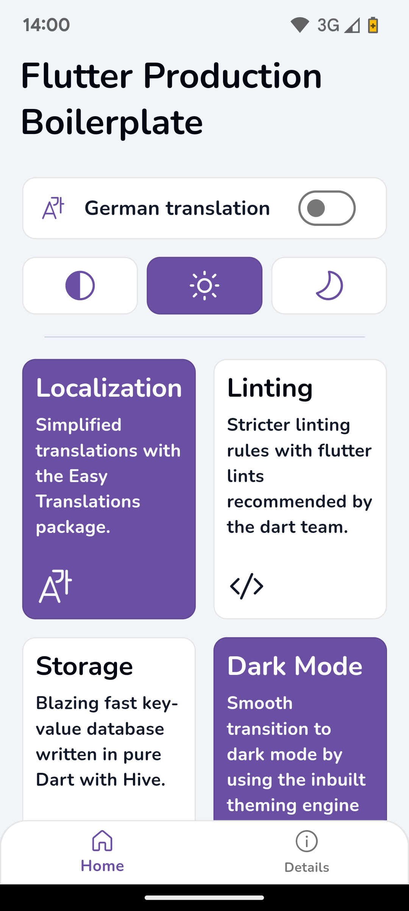
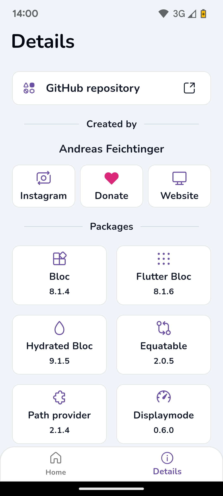
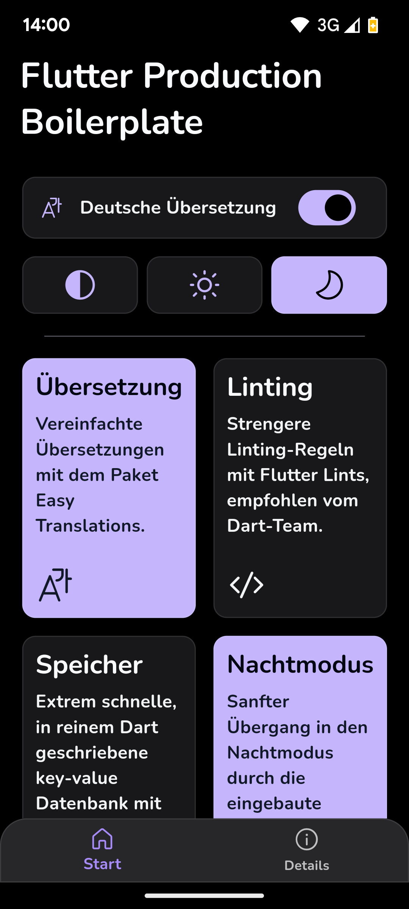
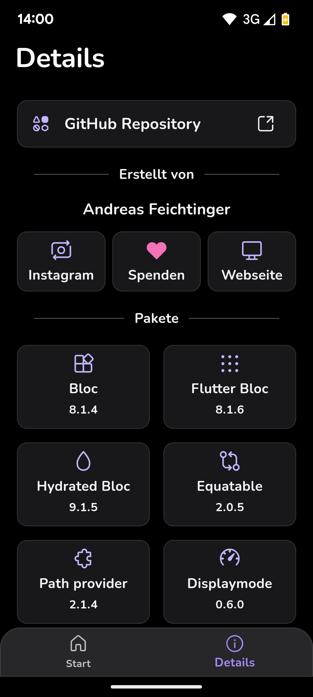

# Flutter Production Boilerplate

## A flutter project containing bloc, flutter_lints, hive, easy_translations and more!

This repository is the starting point for my personal projects. If you have any suggestions or
improvements feel free to let me know. The project strives to implement best practices recommended
by Google and other developers. These best practices include but are not limited to:

- Using BLOC & Cubit for state management.
- Using Flutter Lints for stricter linting rules.
- Using Hive for platform independent storage that also works for web.
- Project structure, const constructors, extracted widgets and many more...

## Installation

This repository requires [Flutter](https://flutter.dev/docs/get-started/install) to be installed and
present in your development environment.

Clone the project and enter the project folder.

```sh
git clone https://github.com/anfeichtinger/flutter_production_boilerplate.git
cd flutter_production_boilerplate
```

You can remove the screenshots located in [assets/img/](./assets/img).

Get the dependencies.

```sh
flutter pub get
```

Run the app via command line or through your development environment. (optional)

```sh
flutter run lib/main.dart
```

## Pub packages

This repository makes use of the following pub packages:

| Package                                                             | Version | Usage                                                |
|---------------------------------------------------------------------|---------|------------------------------------------------------|
| [Bloc](https://pub.dev/packages/bloc)                               | ^8.1.2  | State management*                                    |
| [Flutter Bloc](https://pub.dev/packages/flutter_bloc)               | ^8.1.3  | State management*                                    |
| [Hydrated Bloc](https://pub.dev/packages/hydrated_bloc)             | ^9.1.3  | Persists Bloc state with Hive                        |
| [Equatable](https://pub.dev/packages/equatable)                     | ^2.0.5  | Easily compare custom classes, used for Bloc states* |
| [Flutter Lints](https://pub.dev/packages/flutter_lints)             | ^3.0.1  | Stricter linting rules                               |
| [Path Provider](https://pub.dev/packages/path_provider)             | ^2.1.2  | Get the save path for Hive                           |
| [Flutter Displaymode](https://pub.dev/packages/flutter_displaymode) | ^0.6.0  | Support high refresh rate displays                   |
| [Easy Localization](https://pub.dev/packages/easy_localization)     | ^3.0.3  | Makes localization easy                              |
| [Hive](https://pub.dev/packages/hive)                               | ^2.2.3  | Platform independent storage.                        |
| [Url Launcher](https://pub.dev/packages/url_launcher)               | ^6.2.4  | Open urls in Browser                                 |
| [FluentUI Icons](https://pub.dev/packages/fluentui_system_icons)    | ^0.2.2  | Microsoft's open source icon library                 |

> \* Recommended to keep regardless of your project

## Using this package as a starting point

After following the installation steps you can customize your project. The screens and widgets that
are inside the project can be easily replaced or removed. They are supposed to give the user a basic
understanding of the relations between widgets and some good practices. The code includes some
comments with documentation and examples. The examples can be found by searching for "Example:"
inside the project files.

### Changing the package and app name

You can follow the instructions in this [Stackoverflow issue](https://stackoverflow.com/a/51550358).

### Theme

You can customize your brand colors in the [lib/config/theme.dart](./lib/config/theme.dart) file.
The project uses colors from [TailwindCSS](https://tailwindcss.com/docs/customizing-colors). As
primary swatch the indigo color palette is used while for the text the gray color palette is used.
Feel free to replace those values with your own. In order to get a smooth transition for the text
colors it is necessary to override each text type in the TextTheme.

### Removing unwanted packages

If a package is not listed, then removing it from [pubspec.yaml](./pubspec.yaml) as well as all
imports and uses should be enough. This is required for removing every packages, the following
instructions are an addition to that.

#### Flutter Lints

Delete the [analysis_options.yaml](./analysis_options.yaml) file. As an alternative you can modify
the rules in this file or use a different package like [Lint](https://pub.dev/packages/lint).

#### Easy Localization

Remove the [assets/translations](./assets/translations) folder. Go
to [ios/Runner/Info.plist](./ios/Runner/Info.plist) and remove the following code:

```
<key>CFBundleLocalizations</key>
<array>
	<string>en</string>
   	<string>de</string>
</array>
```

#### Url Launcher

For iOS go to [ios/Runner/Info.plist](./ios/Runner/Info.plist) and remove the following code:

```
<key>LSApplicationQueriesSchemes</key>
<array>
  <string>https</string>
  <string>http</string>
</array>
```

For Android you can take a look at this [Stackoverflow issue](https://stackoverflow.com/a/65082750)
for more information. Go
to [android/app/src/AndroidManifest.xml](./android/app/src/main/AndroidManifest.xml) and remove the
following code:

```
<queries>
     <intent>
        <action android:name="android.intent.action.VIEW" />
        <data android:scheme="https" />
    </intent>
</queries>
```

## Screenshots

#### Light Theme

| Home Light                                                                     | Info Light                                                                    |
|--------------------------------------------------------------------------------|-------------------------------------------------------------------------------|
|  |  |

#### Dark Theme

| Home Dark German                                                             | Info Dark German                                                            |
|------------------------------------------------------------------------------|-----------------------------------------------------------------------------|
|  |  |

## License

MIT
